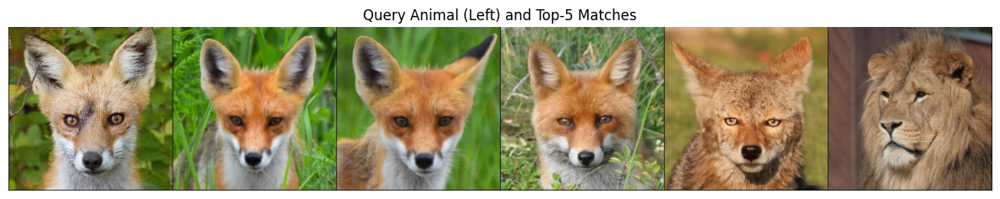

# 🐾 Animal Image Retrieval (CBIR) using Autoencoder

이 프로젝트는 **Convolutional Autoencoder**(**CAE**)를 활용하여 동물 이미지의 핵심 특징(Latent Feature)을 추출하고, 이를 기반으로 유사한 이미지를 검색하는 **내용 기반 이미지 검색(Content-Based Image Retrieval, CBIR)** 시스템을 구현한 과제입니다.

---

## 1. 개요
* **목표**: 동물 이미지 데이터셋을 학습하여 이미지를 저차원 벡터로 압축하고, 질의(Query) 이미지와 가장 유사한 특징을 가진 이미지를 검색합니다.
* **데이터셋**: [Animal Faces HQ (AFHQ)](https://www.kaggle.com/datasets/theaayushbajaj/animal-faces-hq-256x256)
* **주요 라이브러리**: `PyTorch`, `torchvision`, `scikit-learn`, `matplotlib`

---

## 2. 모델 아키텍처
첨부된 소스 코드(`19. 오토인코더 (1).ipynb`)의 설계를 바탕으로 **GELU** 활성화 함수와 **Linear Bottleneck** 구조를 적용했습니다.

### Encoder
* **Input**: $512 \times 512 \times 3$ RGB Image
* **Layers**:
    * 3x3 Conv (Stride 3) $\rightarrow$ MaxPool (2x2)
    * 3x3 Conv (Stride 2) $\rightarrow$ MaxPool (2x1)
    * Flatten $\rightarrow$ Linear ($8 \times 42 \times 42 \rightarrow$ Latent Dim)
* **Latent Space**: **512**차원의 특징 벡터 추출

### Decoder
* **Layers**:
    * Linear $\rightarrow$ Reshape ($8 \times 42 \times 42$)
    * ConvTranspose2d (Stride 2) $\rightarrow$ 85x85
    * ConvTranspose2d (Stride 3) $\rightarrow$ 255x255
    * ConvTranspose2d (Stride 2) $\rightarrow$ 512x512
* **Output**: $512 \times 512 \times 3$ Reconstructed Image (`Tanh` Activation)

---

## 3. 주요 기능
* **Feature Extraction**: 학습된 인코더를 통해 모든 데이터셋 이미지의 잠재 특징 벡터를 추출하여 인덱싱합니다.
* **Similarity Search**: `torch.cdist`를 활용하여 유클리디안 거리(Euclidean Distance)가 가장 가까운 **Top-K** 이미지를 검색합니다.
* **Visualization**: 질의 이미지와 검색된 결과를 Grid 형태로 시각화하여 성능을 비교합니다.

---

## 4. 실행 방법
1. **Kaggle API 설정**: `kaggle.json`을 준비하여 `opendatasets` 라이브러리로 데이터를 다운로드합니다.
2. **Preprocessing**: $512 \times 512$ 해상도로 리사이즈 및 정규화(**$[-1, 1]$**)를 수행합니다.
3. **Training**: `MSELoss`를 사용하여 재구성 오차를 최소화하도록 학습합니다. (추천: **10~20 Epoch**)
4. **Retrieval**: `find_similar_images` 함수를 호출하여 결과를 확인합니다.

---

## 5. 결과 시각화 예시

